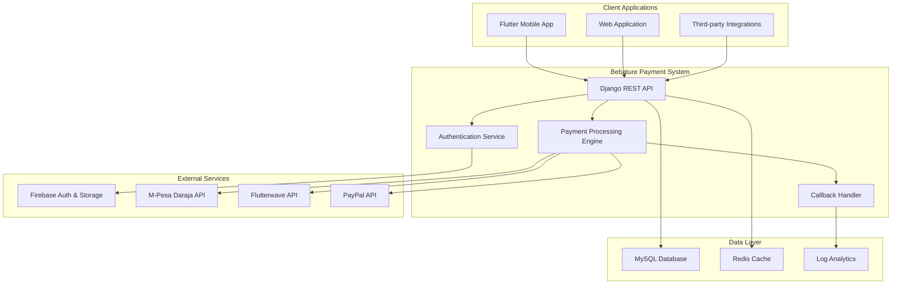

# Bematore Payment System

> **Professional Payment Processing Platform v1.0.0**  
# Bematore Payment System

> Developed by **Brandon Ochieng** | Bematore Technologies

[](https://github.com/OchiengBrandon/bematore-payment-system)
[](https://djangoproject.com/)
[](https://python.org/)
[](https://mysql.com/)
[](https://firebase.google.com/)
[](https://bematore.com)

---

## 🌟 Executive Summary

The **Bematore Payment System** is an enterprise-grade, HIPAA-compliant payment processing platform specifically engineered for Bematore Technologies. This professional system serves as an external payment gateway, ensuring seamless compliance with Apple App Store guidelines while delivering robust, scalable payment processing capabilities for healthcare applications.

### 🎯 Mission Statement
*Empowering mental health professionals, hospitals, first responders, and corporate wellness programs with secure, reliable, and compliant payment processing solutions.*

---

## 🏢 Enterprise Features

### 🔒 **Security & Compliance**
- **HIPAA Compliance**: Healthcare-grade security standards
- **PCI-DSS Level 1**: Bank-grade payment card security
- **End-to-End Encryption**: AES-256 encryption for all transactions
- **Multi-Factor Authentication**: Enhanced security protocols
- **Audit Logging**: Comprehensive transaction tracking

### 🌐 **Global Payment Infrastructure**
- **Active Integration**: M-Pesa Daraja API (Fully Operational)
- **In Development**: Flutterwave, PayPal integrations
- **Currency Support**: KES, USD with expansion planned
- **Real-Time Processing**: M-Pesa STK Push integration
- **24/7 Monitoring**: Comprehensive transaction logging

### 🚀 **Technical Excellence**
- **Microservices Architecture**: Scalable, maintainable design
- **Firebase Integration**: Real-time synchronization
- **RESTful APIs**: Standard HTTP/JSON interfaces
- **Comprehensive Logging**: Enterprise-grade monitoring
- **Docker Ready**: Containerized deployment

---

## 🏗️ System Architecture



---

## 🎯 Target Industries

### 🏥 **Healthcare Sector**
- Mental health clinics and hospitals
- Private practice therapists and psychiatrists
- Telehealth platforms
- Healthcare management systems

### 🚑 **Emergency Services**
- First responder support programs
- EMS mental health services
- Emergency counseling services
- Crisis intervention programs

### 🏢 **Corporate Wellness**
- Employee assistance programs (EAP)
- Corporate mental health initiatives
- Workplace wellness platforms
- Human resources applications

---

## 📋 Prerequisites

### System Requirements
- **Python**: 3.11 or higher
- **Django**: 4.2 or higher
- **Database**: MySQL 8.0+ (Production) / SQLite (Development)
- **Memory**: 4GB RAM minimum, 8GB recommended
- **Storage**: 10GB available space

### Development Environment
```bash
# Clone the repository
git clone https://github.com/OchiengBrandon/bematore-payment-system.git
cd bematore-payment-system

# Create virtual environment
python -m venv venv
source venv/bin/activate  # On Windows: venv\Scripts\activate

# Install dependencies
pip install -r requirements.txt
```

---

## ⚙️ Configuration

### Environment Variables (.env)
```bash
# Django Configuration
SECRET_KEY=your-super-secret-key-here
DEBUG=False
ALLOWED_HOSTS=payments.bematore.com,localhost

# Database Configuration
DB_ENGINE=django.db.backends.mysql
DB_NAME=bematore_payments
DB_USER=your_db_user
DB_PASSWORD=your_db_password
DB_HOST=localhost
DB_PORT=3306

# Firebase Configuration
FIREBASE_CREDENTIALS_PATH=firebase-adminsdk.json

# M-Pesa Configuration
MPESA_ENVIRONMENT=production  # or sandbox
MPESA_CONSUMER_KEY=your_consumer_key
MPESA_CONSUMER_SECRET=your_consumer_secret
MPESA_PASSKEY=your_passkey
MPESA_SHORTCODE=your_shortcode

# Flutterwave Configuration
FLUTTERWAVE_PUBLIC_KEY=your_public_key
FLUTTERWAVE_SECRET_KEY=your_secret_key

# PayPal Configuration
PAYPAL_CLIENT_ID=your_client_id
PAYPAL_CLIENT_SECRET=your_client_secret
PAYPAL_MODE=live  # or sandbox

# Security Configuration
ADMIN_URL=secure-admin-path/
SESSION_COOKIE_SECURE=True
CSRF_COOKIE_SECURE=True
```

---

## 🚀 Quick Start

### 1. Database Setup
```bash
# Run migrations
python manage.py migrate

# Create superuser
python manage.py createsuperuser
```

### 2. Firebase Setup
1. Download your Firebase Admin SDK JSON file
2. Place it in the project root as `firebase-adminsdk.json`
3. Update your Firebase configuration in settings

### 3. Payment Gateway Configuration
Configure your payment gateways in the Django admin panel or through environment variables.

### 4. Start Development Server
```bash
python manage.py runserver
```

Access the platform at `http://localhost:8000`

---

## 📚 API Documentation

### Authentication Endpoints

#### POST `/api/auth/login/`
Authenticate user with Firebase token.

**Request:**
```json
{
    "firebase_token": "eyJhbGciOiJSUzI1NiIsInR5cCI6IkpXVCJ9..."
}
```

**Response:**
```json
{
    "success": true,
    "user": {
        "uid": "firebase_user_id",
        "email": "user@example.com",
        "name": "John Doe"
    },
    "session_token": "django_session_token"
}
```

### Payment Endpoints

#### POST `/api/payments/create/`
Initialize a new payment transaction.

**Request:**
```json
{
    "amount": 100.00,
    "currency": "USD",
    "payment_method": "mpesa",
    "purpose": "consultation",
    "phone_number": "+254712345678",
    "description": "Mental health consultation payment"
}
```

**Response:**
```json
{
    "success": true,
    "transaction_id": "txn_1234567890",
    "checkout_url": "https://payments.bematore.com/checkout/txn_1234567890",
    "status": "pending"
}
```

#### GET `/api/payments/status/<transaction_id>/`
Check payment transaction status.

**Response:**
```json
{
    "transaction_id": "txn_1234567890",
    "status": "completed",
    "amount": 100.00,
    "currency": "USD",
    "payment_method": "mpesa",
    "timestamp": "2024-01-15T10:30:00Z",
    "receipt_number": "REC123456"
}
```

### Webhook Endpoints

#### POST `/callbacks/mpesa/`
M-Pesa payment callback handler.

#### POST `/callbacks/flutterwave/`
Flutterwave payment callback handler.

#### POST `/callbacks/paypal/`
PayPal payment callback handler.

---

## 🔧 Advanced Configuration

### Custom Payment Methods
```python
# payments/services/custom_gateway.py
from .base_gateway import BasePaymentGateway

class CustomPaymentGateway(BasePaymentGateway):
    def initiate_payment(self, amount, currency, phone_number):
        # Implement custom payment logic
        pass
    
    def verify_payment(self, transaction_id):
        # Implement payment verification
        pass
```

### Webhook Security
```python
# callbacks/middleware.py
class WebhookSecurityMiddleware:
    def __init__(self, get_response):
        self.get_response = get_response
    
    def __call__(self, request):
        if request.path.startswith('/callbacks/'):
            # Implement webhook signature verification
            pass
        return self.get_response(request)
```

---

## 🧪 Testing

### Run Test Suite
```bash
# Run all tests
python manage.py test

# Run specific test modules
python manage.py test payments.tests
python manage.py test callbacks.tests

# Run with coverage
coverage run --source='.' manage.py test
coverage report
coverage html
```

### Test Payment Integration
```bash
# Test M-Pesa integration
python manage.py test_mpesa_integration

# Test Flutterwave integration
python manage.py test_flutterwave_integration
```

---

## 🚀 Deployment

### Production Deployment (cPanel)

#### 1. Server Requirements
- **Python**: 3.11+
- **MySQL**: 8.0+
- **SSL Certificate**: Required for production

#### 2. Environment Setup
```bash
# Upload files to cPanel
# Configure Python app in cPanel
# Set up MySQL database
# Configure environment variables
```

#### 3. SSL Configuration
```bash
# Ensure SSL is properly configured
# Update ALLOWED_HOSTS
# Set secure cookie settings
```

### Docker Deployment
```dockerfile
FROM python:3.11-slim

WORKDIR /app
COPY requirements.txt .
RUN pip install -r requirements.txt

COPY . .

EXPOSE 8000
CMD ["gunicorn", "bematore_payments.wsgi:application", "--bind", "0.0.0.0:8000"]
```

---

## 📊 Monitoring & Analytics

### Health Check Endpoint
```bash
GET /health/
```

**Response:**
```json
{
    "status": "healthy",
    "version": "1.0.0",
    "database": "connected",
    "firebase": "connected",
    "payment_gateways": {
        "mpesa": "operational",
        "flutterwave": "operational",
        "paypal": "operational"
    },
    "timestamp": "2024-01-15T10:30:00Z"
}
```

### Logging Configuration
```python
LOGGING = {
    'version': 1,
    'disable_existing_loggers': False,
    'handlers': {
        'file': {
            'level': 'INFO',
            'class': 'logging.FileHandler',
            'filename': 'logs/bematore_payments.log',
        },
    },
    'loggers': {
        'payments': {
            'handlers': ['file'],
            'level': 'INFO',
            'propagate': True,
        },
    },
}
```

---

## 🛡️ Security Best Practices

### Data Protection
- All sensitive data encrypted at rest and in transit
- PII data anonymization for analytics
- Regular security audits and penetration testing
- GDPR and HIPAA compliance measures

### Access Control
- Role-based access control (RBAC)
- Multi-factor authentication for admin access
- API rate limiting and throttling
- IP whitelisting for sensitive endpoints

### Monitoring
- Real-time fraud detection
- Suspicious activity alerts
- Comprehensive audit logging
- Performance monitoring and alerting

---

## 🤝 Contributing

We welcome contributions from the community! Please read our [Contributing Guidelines](CONTRIBUTING.md) before submitting pull requests.

### Development Workflow
1. Fork the repository
2. Create a feature branch
3. Make your changes
4. Add tests for new functionality
5. Ensure all tests pass
6. Submit a pull request

---

## 📄 License

This project is proprietary software developed by Brandon Ochieng for Bematore Technologies.

**Copyright © 2025 Bematore Technologies**  
All rights reserved.

---

## 📞 Support & Contact

### Technical Support
- **Email**: brandoncohieng72@gmail.com
- **Developer**: Brandon Ochieng
- **GitHub**: [OchiengBrandon](https://github.com/OchiengBrandon)

### Business Inquiries
- **Platform**: [Bematore.com](https://bematore.com)
- **Support**: Available 24/7 for enterprise clients

---

## 🏆 Acknowledgments

Special thanks to the mental health community and healthcare professionals who inspired the development of this platform. This system is dedicated to improving access to mental health services through reliable, secure payment processing.

---

**Built with ❤️ for Bematore Technologies**
- **Firebase Authentication**: Seamless token-based verification
- **CORS Configuration**: Secure cross-origin request handling
- **SSL/TLS Support**: Production-ready security configurations
- **Rate Limiting**: Built-in protection against abuse

### Data Management
- **Firebase Sync**: Real-time user and payment data synchronization
- **MySQL Database**: Reliable local caching and transaction logging
- **RESTful API**: Clean, documented API endpoints
- **Audit Trails**: Comprehensive payment and user activity logging

## 📊 API Documentation

### Version Information
- **API Version**: v1.0
- **Django Version**: 4.2.7
- **DRF Version**: 3.14.0
- **Python Version**: 3.11+

### Core Endpoints

| Endpoint | Method | Description | Authentication |
|----------|--------|-------------|----------------|
| `/api/v1/payments/` | POST | Initialize payment | Firebase Token |
| `/api/v1/payments/{id}/` | GET | Get payment status | Firebase Token |
| `/api/v1/callbacks/mpesa/` | POST | M-Pesa callback | Webhook |
| `/api/v1/callbacks/flutterwave/` | POST | Flutterwave callback | Webhook |
| `/api/v1/currencies/` | GET | List supported currencies | Firebase Token |
| `/api/v1/exchange-rates/` | GET | Current exchange rates | Firebase Token |

### Payment Flow
1. **Authentication**: Verify Firebase token from mobile app
2. **User Context**: Load user profile and payment history
3. **Payment Initialization**: Create payment session with selected gateway
4. **Processing**: Handle payment through M-Pesa/Flutterwave/PayPal
5. **Callback Processing**: Receive and validate payment status
6. **Firebase Update**: Sync payment status to user profile
7. **Redirect**: Return user to mobile app with results

## 🛠️ Technology Stack

### Backend Framework
- **Django 4.2+**: Web framework with ORM and admin interface
- **Django REST Framework 3.14+**: API development and serialization
- **Firebase Admin SDK 6.2+**: Server-side Firebase integration

### Database & Storage
- **MySQL 8.0+**: Primary database for transactions and caching
- **Firebase Firestore**: Real-time user data and payment records
- **Redis** (Optional): Caching and session management

### Payment Integrations
- **M-Pesa Daraja API**: Direct integration for Kenyan mobile payments
- **Flutterwave API**: International card and bank transfers
- **PayPal REST API**: Alternative payment method

### Security & Authentication
- **Firebase Authentication**: Token-based user verification
- **CORS Middleware**: Cross-origin request security
- **WhiteNoise**: Static file serving with compression
- **SSL/TLS**: Production-ready HTTPS configuration

## 🔧 Installation & Setup

### Prerequisites
- Python 3.11+
- MySQL 8.0+
- Firebase Project with Admin SDK
- Payment gateway credentials (M-Pesa, Flutterwave, PayPal)

### Local Development
```bash
# Clone repository
git clone https://github.com/bematore/payment-system.git
cd payment-system

# Create virtual environment
python -m venv venv
source venv/bin/activate  # Windows: venv\Scripts\activate

# Install dependencies
pip install -r requirements.txt

# Configure environment
cp .env.example .env
# Edit .env with your configuration

# Database setup
python manage.py makemigrations
python manage.py migrate
python manage.py createsuperuser

# Run development server
python manage.py runserver
```

### Production Deployment (cPanel)
```bash
# Upload files to cPanel
# Configure database in cPanel MySQL
# Update .env with production values
# Set up static files
python manage.py collectstatic --noinput

# Run migrations
python manage.py migrate
```

## 📝 Configuration

### Environment Variables
Key configuration variables for production deployment:

```env
# Django Core
SECRET_KEY=your-production-secret-key
DEBUG=False
ALLOWED_HOSTS=payments.bematore.com,www.bematore.com

# Database Configuration
DB_NAME=bematore_payments
DB_USER=your_mysql_user
DB_PASSWORD=your_mysql_password
DB_HOST=localhost
DB_PORT=3306

# Firebase Configuration
FIREBASE_PROJECT_ID=bematore-public-app-d47e5
FIREBASE_PRIVATE_KEY_PATH=firebase-adminsdk.json

# Payment Gateway Configuration
MPESA_CONSUMER_KEY=your_mpesa_consumer_key
MPESA_CONSUMER_SECRET=your_mpesa_consumer_secret
FLUTTERWAVE_SECRET_KEY=your_flutterwave_secret
```

## 🧪 Testing

```bash
# Run unit tests
python manage.py test

# Run specific app tests
python manage.py test payments
python manage.py test authentication

# Coverage report
coverage run --source='.' manage.py test
coverage report
```

## 📦 Deployment

### Production Checklist
- [ ] Environment variables configured
- [ ] Database migrations applied
- [ ] Static files collected
- [ ] SSL certificate installed
- [ ] Payment gateway webhooks configured
- [ ] Firebase service account setup
- [ ] Monitoring and logging enabled

### Performance Optimization
- Database indexing for payment queries
- Redis caching for exchange rates
- CDN integration for static files
- Database connection pooling
- Celery for background tasks

## 🤝 Contributing

This project follows professional development standards:

1. **Code Style**: Black formatting, PEP 8 compliance
2. **Testing**: Comprehensive unit and integration tests
3. **Documentation**: Inline comments and API documentation
4. **Security**: Regular dependency updates and security audits

## 📞 Support & Contact

**Developer**: Brandon Ochieng  
**Email**: brandon@bematore.com  
**Company**: Bematore Technologies  
**Website**: https://bematore.com  

For technical support or feature requests, please contact the development team through official channels.

## 📄 License

This project is proprietary software developed for Bematore Technologies. All rights reserved.

---

*Built with ❤️ for Bematore by [Brandon Ochieng](https://github.com/OchiengBrandon)*